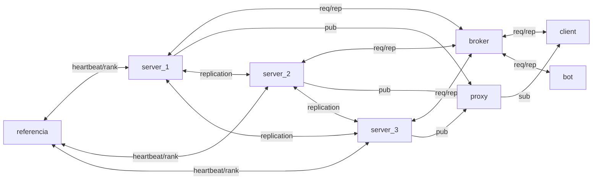

# BulletInBoard

## Descrição Geral
BulletInBoard é um sistema distribuído para troca de mensagens entre clientes e servidores, com arquitetura baseada em containers Docker e comunicação via ZeroMQ e MessagePack. O projeto implementa consistência, replicação ativa, sincronização de relógios lógicos (Lamport) e físicos (Berkeley), além de tolerância a falhas.

## Linguagens e Tecnologias
O projeto foi desenvolvido utilizando múltiplas linguagens de programação para demonstrar a interoperabilidade do sistema distribuído:

- **Python**: Implementação dos servidores, broker, proxy e servidor de referência
- **C**: Cliente manual interativo para operações do usuário
- **JavaScript (Node.js)**: Cliente automatizado (bot) para testes e demonstrações

Essa arquitetura poliglota demonstra a flexibilidade do MessagePack e ZeroMQ para integração entre diferentes tecnologias.

## Arquitetura
O sistema é composto pelos seguintes containers:

- **Broker**: Faz o balanceamento de carga entre os servidores usando ZeroMQ (ROUTER/DEALER). Recebe mensagens dos clientes e distribui para os servidores de forma round-robin, garantindo distribuição uniforme da carga.
- **Proxy**: Intermedia a comunicação PUB/SUB entre publishers (servidores) e subscribers (clientes), permitindo que mensagens publicadas sejam distribuídas para todos os interessados.
- **Servidores (3 réplicas)**: Armazenam dados persistentes, processam requisições e replicam alterações entre si para garantir consistência. Implementam relógio lógico e sincronização física.
- **Cliente (C)**: Interface interativa para o usuário realizar login, cadastrar canais, listar usuários/canais, publicar mensagens em canais e enviar mensagens privadas.
- **Cliente Automático (JavaScript)**: Bot que executa todas as operações disponíveis de forma automática e cíclica, útil para testes de carga e demonstrações do sistema.
- **Servidor de Referência**: Gerencia o registro de servidores, atribui ranks únicos, monitora heartbeats e fornece lista atualizada de servidores ativos para coordenação da eleição de líder.

## Troca de Mensagens
Todas as mensagens entre processos são serializadas usando MessagePack, tornando a comunicação eficiente e compatível entre diferentes linguagens.


### Formato das Mensagens (MessagePack)
Todas as mensagens são serializadas e desserializadas usando MessagePack:

```python
# Exemplo de envio de mensagem
import msgpack

mensagem = {
	"opcao": "login",  # "login | listar usuarios | cadastrar canal | listar canais | publicar mensagem | enviar mensagens para um usuario especifico"
	"dados": {
		"user": "usuario1",
		"canal": "canal1",  # se aplicável
		"message": "Olá!",  # se aplicável
		"timestamp": 1698250000.0,
		"clock": 42
	}
}

# Serializar para envio
msg_serializada = msgpack.packb(mensagem)
# Desserializar ao receber
msg_recebida = msgpack.unpackb(msg_serializada, raw=False)
```

## Broker
O broker recebe mensagens dos clientes e encaminha para os servidores usando round-robin (balanceamento de carga). Cada mensagem é processada por um servidor, que replica para os demais para garantir consistência.

## Proxy
O proxy utiliza o padrão XSUB/XPUB do ZeroMQ para distribuir mensagens publicadas pelos servidores para todos os subscribers (clientes).

## Persistência de Dados
Os servidores armazenam dados de forma persistente em arquivos JSON, garantindo que informações não sejam perdidas em caso de reinicialização:

- **usuarios.json**: Armazena a lista de usuários cadastrados com seus timestamps
- **canais.json**: Armazena a lista de canais criados com seus timestamps
- **publicacoes.json**: Histórico de todas as mensagens publicadas em canais
- **mensagens.json**: Histórico de todas as mensagens privadas entre usuários

Os dados são salvos no diretório `/app/dados` dentro de cada container de servidor e são recarregados periodicamente (a cada 2 segundos) para sincronização entre réplicas.

## Replicação e Consistência
O sistema implementa um modelo de **replicação ativa** onde todos os servidores mantêm cópias idênticas dos dados:

1. **Recebimento via Broker**: O broker distribui requisições dos clientes para os servidores usando round-robin (balanceamento de carga).

2. **Processamento e Replicação**: Quando um servidor recebe uma mensagem que altera o estado (login, cadastro de canal, publicação, mensagem privada):
   - Processa a requisição e atualiza seu estado local
   - Salva os dados em arquivos JSON para persistência
   - **Replica a operação para todos os outros servidores** através de conexão direta

3. **Porta de Replicação**: Cada servidor possui uma porta dedicada (5562) para receber replicações de outros servidores.

4. **Prevenção de Loops**: As mensagens replicadas possuem o campo `replicated: True`, garantindo que não sejam replicadas novamente.

5. **Sincronização Completa**: Com este modelo, todos os 3 servidores recebem e processam todas as operações, mantendo estados idênticos e garantindo que qualquer servidor possa responder corretamente a requisições subsequentes.

## Relógio Lógico (Lamport)
Todos os processos (cliente, bot, servidor) implementam relógio lógico:
- O clock é incrementado antes de cada envio de mensagem.
- O clock é atualizado ao receber uma mensagem, usando o máximo entre o valor recebido e o atual.
- O valor do clock é incluído em todas as mensagens.

## Servidor de Referência e Eleição de Líder
O servidor de referência é um componente crítico que gerencia o registro e monitoramento dos servidores:

### Funcionalidades:
1. **Registro de Servidores**: Cada servidor se registra ao iniciar, recebendo um rank único (1, 2, 3, ...)
2. **Monitoramento (Heartbeat)**: Recebe heartbeats periódicos (a cada 10 segundos) de todos os servidores ativos
3. **Lista de Servidores Ativos**: Mantém e fornece lista atualizada de servidores que estão respondendo
4. **Coordenação de Eleição**: Facilita o algoritmo de eleição Bully para escolha do coordenador

### Algoritmo de Eleição (Bully):
- Quando um servidor detecta falha do coordenador atual, inicia uma eleição
- Envia mensagens "election" para todos os servidores com rank maior
- Se nenhum servidor de rank maior responder, o servidor se declara coordenador
- O novo coordenador é anunciado via PUB/SUB para todos os servidores
- O servidor com maior rank sempre se torna o coordenador

Este mecanismo garante que sempre haja um coordenador ativo para sincronização de relógios, mesmo em caso de falhas.

## Sincronização de Relógio Físico (Berkeley)
Os servidores sincronizam seus relógios físicos usando o algoritmo de Berkeley simplificado:

- O **coordenador** (servidor eleito com maior rank) atua como referência de tempo
- Servidores não-coordenadores consultam o coordenador a cada 30 segundos
- Calculam o ajuste considerando o RTT (Round Trip Time) da comunicação
- Aplicam o ajuste gradualmente para evitar saltos bruscos no tempo
- Se o coordenador falhar (timeout), uma nova eleição é iniciada automaticamente

## Fluxo de Comunicação


### Descrição do Fluxo:
1. **Clientes → Broker**: Clientes (manual e bots) enviam requisições via REQ/REP para o broker
2. **Broker → Servidores**: O broker distribui requisições entre os 3 servidores usando round-robin
3. **Servidor Primário**: Processa a requisição, salva em JSON e responde ao cliente via broker
4. **Replicação**: O servidor que processou replica a operação diretamente para os outros 2 servidores
5. **Sincronização**: Todos os 3 servidores mantêm estados idênticos através de replicação ativa
6. **Pub/Sub**: Servidores publicam mensagens/eventos via proxy para subscribers (clientes)
7. **Referência**: Servidores se comunicam com o servidor de referência para coordenação e eleição

## Cliente Automático (Bot)
O cliente automático, implementado em JavaScript/Node.js, executa um ciclo contínuo de operações para demonstrar e testar o sistema:

### Operações do Bot (Ciclo de 5 etapas):
1. **Listar Usuários**: Consulta todos os usuários cadastrados no sistema
2. **Cadastrar Canal**: Tenta criar canais aleatórios (geral, noticias, tecnologia, esportes, games)
3. **Listar Canais**: Consulta todos os canais disponíveis
4. **Publicar em Canal**: Publica mensagens aleatórias em canais existentes
5. **Mensagem Privada**: Envia mensagens diretas para outros usuários online

### Características:
- Executa todas as operações que o cliente manual oferece
- Intervalo de 3 segundos entre operações para não sobrecarregar
- Gera logs claros visíveis nos servidores
- Útil para testes de carga e demonstrações do sistema distribuído
- Múltiplos bots podem ser executados simultaneamente

## Tolerância a Falhas
Se um servidor falhar, os demais continuam operando e possuem o histórico completo das mensagens, garantindo alta disponibilidade e consistência. O sistema implementa:

- **Replicação Ativa**: Todos os servidores mantêm estados idênticos
- **Persistência**: Dados salvos em JSON sobrevivem a reinicializações
- **Eleição Automática**: Novo coordenador é eleito automaticamente em caso de falha
- **Heartbeat**: Monitoramento contínuo da saúde dos servidores

## Como Executar

### Subir o Sistema Completo:
```bash
docker compose up --build
```

### Interagir com o Cliente Manual (C):
```bash
docker attach cliente
```
Opções disponíveis:
- [1] Login
- [2] Listar usuários
- [3] Cadastrar canal
- [4] Listar canais
- [5] Publicar em canal
- [6] Mensagem privada
- [0] Sair

### Visualizar Logs dos Servidores:
```bash
# Servidor 1
docker attach projeto_sd-servidor-1

# Servidor 2
docker attach projeto_sd-servidor-2

# Servidor 3
docker attach projeto_sd-servidor-3
```

### Visualizar Bot em Ação:
```bash
docker logs -f projeto_sd-cliente_automatico-1
```

### Escalar Bots (opcional):
```bash
docker compose up --scale cliente_automatico=5
```
Isso criará 5 bots simultâneos testando o sistema.

## Solução do Problema de Alinhamento dos Servidores

### Desafio:
Como garantir que os 3 servidores recebam e processem todas as operações, mantendo estados consistentes, quando o broker distribui requisições usando round-robin?

### Solução Implementada - Replicação Ativa:

1. **Distribuição Inicial**: O broker envia cada requisição do cliente para apenas 1 servidor (balanceamento de carga)

2. **Processamento + Replicação**: O servidor que recebe a requisição:
   - Processa a operação localmente
   - Salva os dados em JSON
   - **Envia cópias da operação para os outros 2 servidores** via porta dedicada (5562)

3. **Recepção de Réplicas**: Os outros servidores:
   - Recebem a operação replicada na porta 5562
   - Identificam pelo campo `replicated: True`
   - Aplicam a mesma operação em seus estados locais
   - Salvam em seus arquivos JSON
   - **NÃO replicam novamente** (prevenção de loops)

4. **Resultado**: Todos os 3 servidores possuem estados idênticos:
   - Mesma lista de usuários
   - Mesmos canais cadastrados
   - Mesmo histórico de mensagens

### Vantagens desta Abordagem:
- ✅ Balanceamento de carga no processamento inicial
- ✅ Consistência forte entre todos os servidores
- ✅ Tolerância a falhas (qualquer servidor pode responder)
- ✅ Persistência garantida por arquivos JSON
- ✅ Sincronização automática via recarga periódica

## Observações Técnicas

### Serialização:
- Todos os serviços usam **MessagePack** para serialização eficiente e compatibilidade entre linguagens
- Formato binário compacto, mais eficiente que JSON para tráfego de rede

### Comunicação:
- **REQ/REP** para requisições cliente-servidor (síncrono)
- **ROUTER/DEALER** para balanceamento de carga no broker
- **PUB/SUB (XPUB/XSUB)** para distribuição de eventos e eleições
- **REQ/REP dedicado** para replicação entre servidores (porta 5562)

### Escalabilidade:
- Sistema pode ser expandido para mais de 3 servidores
- Bots podem ser escalados horizontalmente: `docker compose up --scale cliente_automatico=N`
- Arquitetura suporta múltiplos clientes simultâneos

### Linguagens e Interoperabilidade:
- Python, C e JavaScript operando perfeitamente juntos
- Demonstra a flexibilidade do MessagePack e ZeroMQ
- Facilita integração com outros sistemas e linguagens

---
**Projeto completo de sistema distribuído com replicação ativa, consistência forte, eleição de líder e tolerância a falhas.**