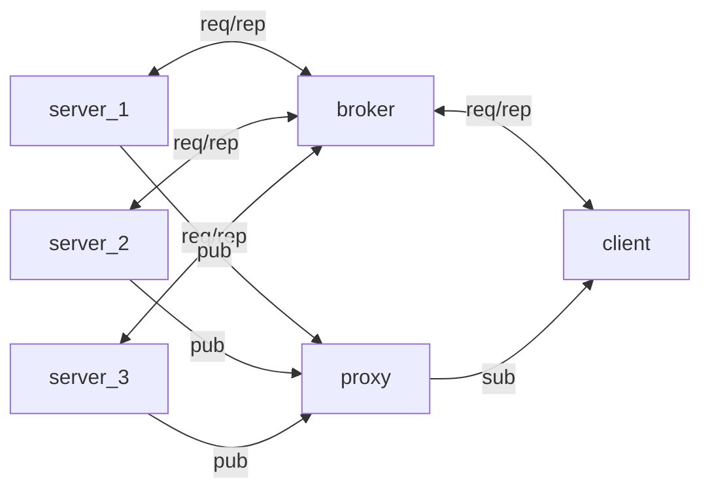

# BulletInBoard

## Descrição Geral
BulletInBoard é um sistema distribuído para troca de mensagens entre clientes e servidores, com arquitetura baseada em containers Docker e comunicação via ZeroMQ e MessagePack. O projeto implementa consistência, replicação ativa, sincronização de relógios lógicos (Lamport) e físicos (Berkeley), além de tolerância a falhas.

## Arquitetura
O sistema é composto pelos seguintes containers:

- **Broker**: Faz o balanceamento de carga entre os servidores usando ZeroMQ (ROUTER/DEALER ou REQ/REP). Recebe mensagens dos clientes e encaminha para os servidores.
- **Proxy**: Intermedia a comunicação PUB/SUB entre publishers (servidores) e subscribers (clientes), permitindo que mensagens publicadas sejam distribuídas para todos os interessados.
- **Servidores**: Armazenam o histórico de mensagens, processam requisições e replicam dados entre si para garantir consistência. Implementam relógio lógico e sincronização física.
- **Cliente**: Interface para o usuário enviar e receber mensagens, com relógio lógico.
- **Referência**: Serviço para sincronização de relógio físico, rank e heartbeat dos servidores.

## Troca de Mensagens
Todas as mensagens entre processos são serializadas usando MessagePack, tornando a comunicação eficiente e compatível entre diferentes linguagens.


### Formato das Mensagens (MessagePack)
Todas as mensagens são serializadas e desserializadas usando MessagePack:

```python
# Exemplo de envio de mensagem
import msgpack

mensagem = {
	"opcao": "login",  # "login | listar usuarios | cadastrar canal | listar canais | publicar mensagem | enviar mensagens para um usuario especifico"
	"dados": {
		"user": "usuario1",
		"canal": "canal1",  # se aplicável
		"message": "Olá!",  # se aplicável
		"timestamp": 1698250000.0,
		"clock": 42
	}
}

# Serializar para envio
msg_serializada = msgpack.packb(mensagem)
# Desserializar ao receber
msg_recebida = msgpack.unpackb(msg_serializada, raw=False)
```

## Broker
O broker recebe mensagens dos clientes e encaminha para os servidores usando round-robin (balanceamento de carga). Cada mensagem é processada por um servidor, que replica para os demais para garantir consistência.

## Proxy
O proxy utiliza o padrão XSUB/XPUB do ZeroMQ para distribuir mensagens publicadas pelos servidores para todos os subscribers (clientes).

## Replicação e Consistência ---------------- ajustar isso para a nova atualização do broker
Cada servidor, ao receber uma mensagem que altera o estado (login, cadastro de canal, publicação, mensagem privada), replica essa mensagem para os outros servidores. Isso garante que todos tenham o histórico completo, mesmo se algum servidor falhar.

Para evitar loops de replicação, as mensagens replicadas possuem o campo `replicado: True` e só são replicadas se esse campo não estiver presente.

## Relógio Lógico (Lamport)
Todos os processos (cliente, bot, servidor) implementam relógio lógico:
- O clock é incrementado antes de cada envio de mensagem.
- O clock é atualizado ao receber uma mensagem, usando o máximo entre o valor recebido e o atual.
- O valor do clock é incluído em todas as mensagens.

## Sincronização de Relógio Físico (Berkeley)
Os servidores sincronizam seus relógios físicos usando o algoritmo de Berkeley, com o serviço de referência atuando como coordenador. A cada 10 mensagens trocadas, os servidores atualizam seus relógios consultando o coordenador.

## Fluxo de Comunicação


## Tolerância a Falhas
Se um servidor falhar, os demais continuam operando e possuem o histórico completo das mensagens, garantindo alta disponibilidade e consistência.

## Como Executar
1. Configure o `docker-compose.yml` com as réplicas desejadas para os servidores
2. Execute `docker compose up --build` para subir todos os containers.
3. Use o cliente  para enviar mensagens e testar o sistema atraves do `docker attach cliente` em um terminal, e abra um outro para abrir cada servidor: `docker attach projeto_sd-servidor-1` (fazer para servidor 1, 2 e 3)

## Observações
- Todos os serviços usam MessagePack para serialização.
- O broker pode ser ajustado para enviar para todos os servidores usando PUB/SUB, mas o padrão recomendado é REQ/REP com replicação ativa nos servidores.
- O sistema pode ser expandido para mais servidores

---
**Documentação completa do funcionamento, arquitetura e decisões de projeto.**