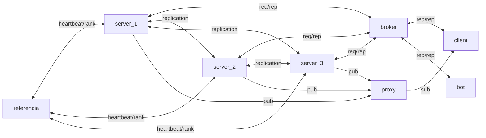

# BulletInBoard

## Descrição
Sistema distribuído para troca de mensagens com arquitetura baseada em containers Docker, ZeroMQ e MessagePack. Implementa replicação ativa, sincronização de relógios (Lamport e Berkeley), eleição de líder e tolerância a falhas.

## Linguagens Utilizadas
- **Python**: Servidores, broker, proxy e servidor de referência
- **C**: Cliente manual interativo
- **JavaScript (Node.js)**: Bot automatizado para testes

## Componentes

- **Broker**: Balanceamento de carga (ROUTER/DEALER) distribuindo requisições entre servidores usando round-robin
- **Proxy**: Comunicação PUB/SUB (XPUB/XSUB) para distribuir mensagens dos servidores para os clientes
- **Servidores (3 réplicas)**: Processam requisições, armazenam dados em JSON e replicam operações entre si
- **Cliente (C)**: Interface interativa com 6 operações: login, listar usuários, cadastrar canal, listar canais, publicar em canal e mensagens privadas
- **Bot (JavaScript)**: Executa todas as operações automaticamente em ciclos de 3 segundos
- **Servidor de Referência**: Gerencia registro de servidores, atribui ranks, monitora heartbeats e coordena eleições

## Persistência de Dados
Arquivos JSON armazenados em `/app/dados`:
- `usuarios.json`: Lista de usuários cadastrados
- `canais.json`: Lista de canais criados
- `publicacoes.json`: Histórico de mensagens em canais
- `mensagens.json`: Histórico de mensagens privadas

Dados são recarregados a cada 2 segundos para sincronização entre réplicas.

## Replicação Ativa e Alinhamento dos Servidores

**Desafio**: Como garantir que os 3 servidores tenham estados idênticos quando o broker distribui requisições usando round-robin?

**Solução**:
1. Broker envia requisição para apenas 1 servidor (balanceamento de carga)
2. Servidor que recebe: processa, salva em JSON e replica para os outros 2 servidores via porta 5562
3. Outros servidores: recebem replicação, identificam pelo campo `replicated: True`, aplicam localmente e NÃO replicam novamente
4. Resultado: Todos os 3 servidores possuem estados idênticos

**Vantagens**: Balanceamento de carga + Consistência forte + Tolerância a falhas

## Sincronização de Relógios

### Relógio Lógico (Lamport)
Implementado em todos os processos (clientes, bot, servidores):
- Clock incrementado antes de cada envio
- Clock atualizado ao receber (máximo entre atual e recebido)
- Valor incluído em todas as mensagens

### Relógio Físico (Berkeley)
- Coordenador (servidor com maior rank) é referência de tempo
- Servidores consultam coordenador a cada 30 segundos
- Ajuste calculado considerando RTT da comunicação
- Se coordenador falhar, nova eleição é iniciada

## Eleição de Líder (Algoritmo Bully)
1. Servidor de referência atribui rank único a cada servidor ao iniciar
2. Quando coordenador falha, servidor detecta e inicia eleição
3. Envia mensagens "election" para servidores com rank maior
4. Se nenhum responder, se declara coordenador e anuncia via PUB/SUB
5. Servidor com maior rank sempre se torna coordenador

## Fluxo de Comunicação


**Padrões de Comunicação**:
- REQ/REP: Requisições cliente-servidor
- ROUTER/DEALER: Balanceamento de carga no broker
- PUB/SUB: Distribuição de eventos e mensagens
- REQ/REP (porta 5562): Replicação entre servidores

## Bot Automático
Executa ciclo contínuo com 5 operações:
1. Listar usuários
2. Cadastrar canal aleatório
3. Listar canais
4. Publicar em canal aleatório
5. Enviar mensagem privada para usuário aleatório

Útil para testes de carga e demonstrações. Pode ser escalado: `docker compose up --scale cliente_automatico=5`

## Como Executar

### Subir o sistema:
```bash
docker compose up --build
```

### Cliente manual:
```bash
docker attach cliente
```

### Visualizar logs dos servidores:
```bash
docker attach projeto_sd-servidor-1
docker attach projeto_sd-servidor-2
docker attach projeto_sd-servidor-3
```

### Visualizar bot:
```bash
docker logs -f projeto_sd-cliente_automatico-1
```

## Tolerância a Falhas
- **Replicação ativa**: Estados idênticos em todos os servidores
- **Persistência**: Dados sobrevivem a reinicializações
- **Eleição automática**: Novo coordenador eleito em caso de falha
- **Heartbeat**: Monitoramento contínuo (a cada 10s)

---
**Sistema distribuído com replicação ativa, consistência forte, eleição de líder e tolerância a falhas.**
